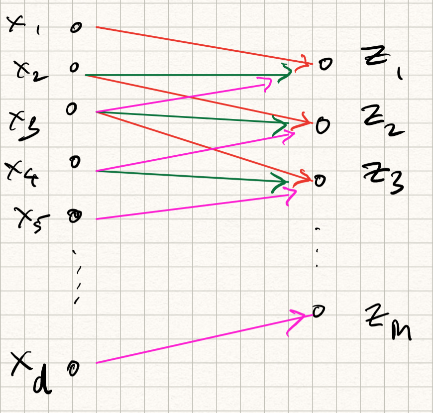
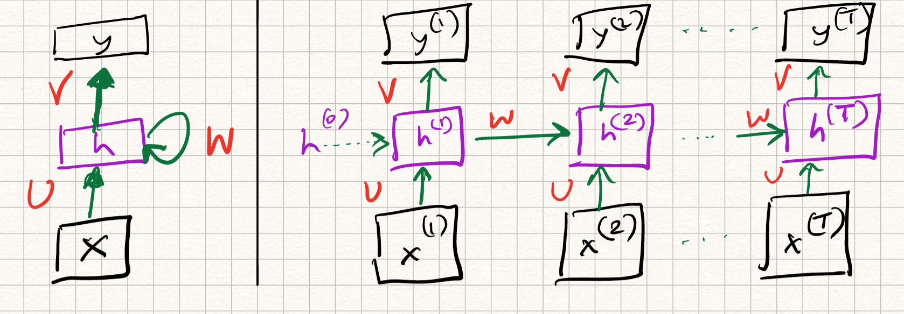
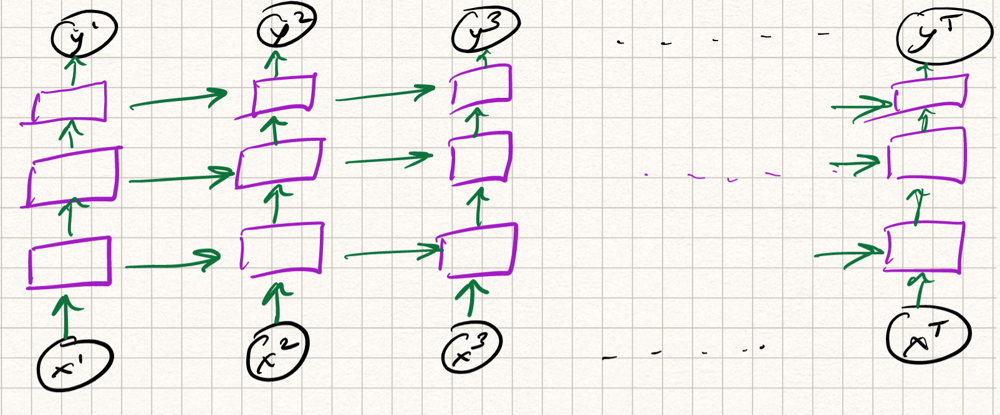

_ECE-GY 6143, Spring 2020_

# Lecture 10: Neural Network Architectures

## Beyond fully connected networks

Thus far, we have introduced neural networks in a fairly generic manner (layers of neurons, with learnable weights and biases, concatenated in a feed-forward manner). We have also seen how such networks can serve very powerful representations, and can be used to solve problems such as image classification.

The picture we have for our network looks something like this:

{ width=60% }

There are a few issues with this picture, however.

The first issue is *computational cost*. Let us assume a simple two layer architecture which takes a 400x400 pixel RGB image as input, has 1000 hidden neurons, and does 10-class classification. The number of trainable parameters is nearly *500 million*. (Imagine now doing this calculation for very deep networks.) For most reasonable architectures, the number of parameters in the network roughly scales as $O(\tilde{d}^2 L)$, where $\tilde{d}$ is the maximum width of the network and $L$ is the number of layers. The quadratic scaling poses a major computational bottleneck.

This also poses a major sample complexity bottleneck -- more parameters (typically) mean that we need a larger training dataset. But until about a decade ago, datasets with hundreds of millions (or billions) of training samples simply weren't available for any application.

The second issue is *loss of context*. In applications such as image classification, the input features are spatial pixel intensities. But what if the image shifts a little? The classifier should still perform well (after all, the content of the image didn't change). But fully connected neural networks don't quite handle this well -- recall that we simply flattened the image into a vector before feeding as input, so spatial information was lost.

A similar issue occurs in applications such as audio/speech, or NLP. Vectorizing the input leads to loss of temporal correlations, and general fully connected nets don't have a mechanism to capture temporal concepts.

The third issue is *confounding features*. Most of our toy examples thus far have been on carefully curated image datasets (such as MNIST, or FashionMNIST) with exactly one object per image. But the real world is full of unpredictable phenomena (there could be occlusions, or background clutter, or strange illuminations). We simply will not have enough training data to robustify our network to all such variations.

## Convolutional neural networks (CNNs)

Fortunately, we can resolve some of the above issues by being a bit more careful with the design of the network architecture. We focus on object detection in image data for now (although the ideas also apply to other domains, such as audio). The two Guiding Principles are as follows:

* *Locality*: neural net classifiers should look at *local* regions in an image, without too much regard to what is happening elsewhere.

* *Shift invariance*: neural net classifiers should have similar responses to the same object no matter where it appears in the image.

Both of these can be realized by defining a new type of neural net architecture, which is composed of *convolution layers*.

### Definition

A quick recap of convolution from signal processing. We have two signals (for our purposes, everything is in discrete-time, so they can be thought of as arrays) $x[t]$ and $w[t]$. Here, $x$ will be called the *input* and $w$ will be called the *filter* or *kernel* (not to be confused with kernel methods). The convolution of $x$ and $w$, denoted by the operation $\star$, is defined as:
$$
(x \star w)[t] = \sum_\tau x[t - \tau] w[\tau] .
$$
It is not too hard to prove that the summation indices can be reversed but the operation remains the same:
$$
(x \star w)[t] = \sum_\tau x[\tau] w[t - \tau] .
$$
In the first sense, we can think of the output of the convolution operation as  "translate-and-scale", i.e., shifting various copies of $x$ by different amounts $\tau$, scaling by $w[\tau]$ and summing up. In the second sense, we can think of it as "flip-and-dot", i.e., flipping $w$ about the $t=0$ axis, shifting by $t$ and taking the dot product with respect to $x$.

This definition extends to 2D images, except with two (spatial) indices:
$$
(x \star w)[s,t] = \sum_\sigma \sum_\tau x[s - \sigma, t - \tau], w[\sigma, \tau]
$$

Convolution has lots of nice properties (one can prove that convolution is linear, associative, and commutative). But the main property of convolution we will leverage is that it is *equivariant* with respect to shifts: if the input $x$ is shifted by some amount in space/time, then the output $x \star w$ is shifted by the same amount. This addresses Principle 2 above.

Moreover, we can also address Principle 1: if we *limit* the support (or the number of nonzero entries) of $w$, then this has the effect that the outputs only depend on local spatial (or temporal) behaviors in $x$!

[Aside: The use of convolution in signal/image processing is not new: convolutions are used to implement things like low-pass filters (which smooth the input) or high-pass filters (which sharpen the input). Composing a high-pass filter with a step-nonlinearity, for example, gives a way to locate sharp regions such as edges in an image. The innovation here is that the filters are treated as learnable from data].

### Convolution layers

We can use the above properties to define convolution layers. Somewhat confusingly, the "flip" in "flip-and-dot" is ignored; we don't flip the filter and hence use a $+$ instead of a $-$ in the indices:
$$
z[s,t] = (x \star w)[s,t] = \sum_{\sigma = -\Delta}^{\Delta} \sum_{\tau = -\Delta}^{\Delta} x[s + \sigma,t + \tau] w[\sigma,\tau].
$$
So, basically like the definition convolution in signal processing but with slightly different notation -- so this is only a cosmetic change. The support of $w$ ranges from $-\Delta$ to $-\Delta$. This induces a corresponding region in the domain of $x$ that influences the outputs, which is called the *receptive field*. We can also choose to apply a nonlinearity $\phi$ to each output:
$$
h[s,t] = \phi(z[s,t]).
$$
The corresponding transformation is called *feature map*. The new picture we have for our convolution layer looks something like this:

{ width=60% }

Observe that this operation can be implemented by matrix multiplication with a set of weights followed by a nonlinear activation function, similar to regular neural networks -- except that there are two differences:

* Instead of being fully connected, each output coefficient is only dependent on  $(2\Delta+1 \times 2\Delta+1)$-subset of input values; therefore, the layer is *sparsely connected*.

* Because of the shift invariance property, the weights of different output neurons are the same (notice that in the summation, the indices in $w$ are independent of $s,t$). Therefore, the *weights are shared*.

The above definition computed a single feature map on a 2D input. However, similar to defining multiple hidden neurons, we can extend this to multiple feature maps operating on multiple input channels (the input channels can be, for example, RGB channels of an image, or the output features of other convolution layers). So in general, if we have $D$ input channels and $F$ output feature maps, we can define:
$$
\begin{aligned}
z_i &= \sum_j x_j \star w_{ij} \\
h_i &= \phi(z_i).
\end{aligned}
$$  

Combining the above properties means that the number of free learnable parameters in this layer is merely $O(\Delta^2 \times D \times F)$. Note that the dimension of the input does not appear at all, and the quadratic dependence is merely on the filter size! So if we use a $5 \times 5$ filter with (say) 20 input feature maps and 10 output feature maps, the number of learnable weights is merely $5000$, which is *several orders of magnitude lower than fully connected networks*!

A couple of more practical considerations:

* *Padding*: if you have encountered discrete-time convolution before, you will know that we need to be careful at the boundaries, and that the sizes of the input/output may differ. This is taken care of by appropriate zero-padding at the boundaries.

* *Strides*: we can choose to subsample our output in case the sizes are too big. This can be done by merely retaining every alternate (or every third, or every fourth..) output index. This is called *stride length*. [The default is to compute all output values, which is called a stride length of 1.]

* *Pooling*: Another way to reduce output size is to aggregate output values within a small spatial or temporal region. Such an aggregation can be performed by computing the mean of outputs within a window (*average pooling*), or computing the maximum (*max pooling*). This also has the advantage that the outputs become robust to small shifts in the input.

So there you have it: all the ingredients of a convolutional network. One of the first success stories of ConvNets was called *LeNet*, invented by LeCun-Bottou-Bengio-Haffner in 1998, which has the following architecture:

{ width=90% }

From 1998 to approximately 2015, most of the major advances in object detection were made using a series of successively deeper convolutional networks:

* AlexNet (2012), which arguably kickstarted the reemergence of neural nets in real-world applications. This resembled LeNet but with more feature maps and layers.

* VGGNet (2014), also similar but even bigger.

* GoogleNet (2014): this was an *all-convolutional* network (no fully connected layers anywhere, except the final classification).

After 2015, deeper networks were constructed using *residual* blocks, which we will only briefly touch upon below.

### Training a CNN

Note that we haven't talked about a separate algorithm for training a CNN. That is because we don't need to: the backpropagation algorithm discussed in the previous lecture works very well! The computation graph is a bit different. Also, the weights are shared, so we need to be a bit more careful while deriving the backward pass rules. We won't derive it again here; most deep learning software packages implement this under the hood.

## Recurrent neural networks (RNNs)

Let us now turn our attention to a different set of applications. Consider natural language processing (NLP), where the goal might be to:

* perform document retrieval: we have already done this before;

* convert speech (audio waveforms) to text: used in Siri, or Google Assistant;

* achieve language translation: used in Google Translate,

* map video to text: used in automatic captioning,

among a host of other applications.

If we think of a speech signal or a sentence in vector/array form, notice that the contents of the vector exhibits *both* short range as well as *long-range* dependencies; for example, the start of a sentence may have relevance to the end of a sentence. (Example: "The cow, in its full glory, jumped over the moon" -- the subject and object are at two opposite ends of the sentence.)

Classically, the tools to solve NLP problems were *Markov* models. If we assume a sequence of words $w = (w_1,w_2,\ldots,w_d)$, and define a probability distribution $P(w)$, then, short-range dependences could be captured via the Markov assumption that the likelihood of each word only depended on the previous word in the sentence:
$$
P(w) = P((w_1,w_2,\ldots,w_d)) = P(w_1) \cdot P(w_2 | w_1) \cdot \ldots P(w_d | w_{d-1}) .
$$
If we were being brave, we could extend it to two, or three, previous words -- but realize that as we introduce more and more dependencies across time, the probability calculations quickly become combinatorially large.

### Definition

An elegant way to resolve this issue and introduce long(er) range dependencies is via *feedback*. Thus far, we have strictly used feedforward connections, which are somewhat limiting in the case of NLP.

Let us now introduce a new type of neural net with *self-loops* which acts on time series, called the *recurrent neural net* (RNN). In reality, the self-loops in the hidden neurons are computed with unit-delay, which really means that the output of the hidden unit at a given time step depends both on the input at that time step, and the output at a previous time step. The mathematical definition of the operations are as follows:
$$
\begin{aligned}
h^{t} &= \phi(U x^{t} + W h^{t-1}) \\
y^{t} &= V h^{t} .
\end{aligned}
$$
So, historical information is stored in the output of the hidden neurons, across different time steps. We can visualize the flow of information across time by "unrolling" the network across time.

{ width=90% }

Observe that the layer weights $U, W, V$ are *constant* over different time steps; they do not vary. Therefore, the RNN can be viewed as a special case of deep neural nets with weight sharing.

### Training an RNN

Again, training an RNN can be done using the same tools as we have discussed before: variants of gradient descent via backpropagation. The twist in this case is the feedback loop, which complicates matters. To simplify this, we simply unroll the feedback loop into $T$ time steps, and perform *backpropagation through time* for this unrolled (deep) network. There is considerable weight sharing here (since all the time instants have the same weight matrices), so we need to be careful when we apply the multivariate chain rules while computing the backward pass. But really it is all about careful book-keeping; conceptually the algorithm is the same.

### Variations

RNNs are very powerful examples of the flexibility of neural nets. Moreover, the above example is for a *single-layer* RNN (which itself -- let us be clear --- is a deep network, if we imagine the RNN to be unrolled over time). We could make it more complex, and define a *multi-layer* RNN by computing the mapping from input to state *itself* via several layers. The equations are messy to write down so let's just draw a picture:

{ width=90% }

Depending on how we define the structure of the intermediate layers, we get various flavors of RNNs:

* Gated Recurrent Units (GRU) networks
* Long Short-Term Memory (LSTM) networks
* Bidirectional RNNs
* Attention networks

and many others. An in-depth discussion of all these networks is unfortunately beyond the scope of this course.
