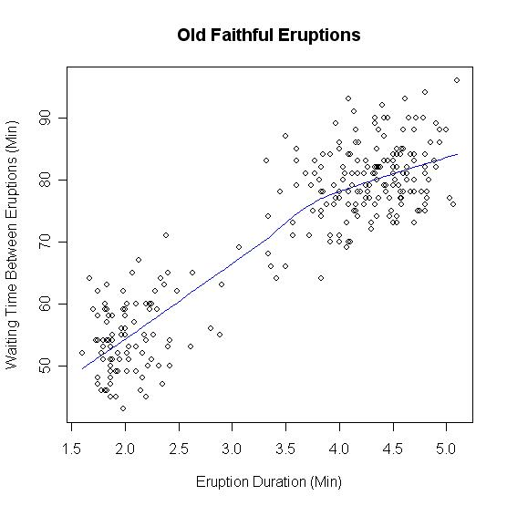

_ECE-GY 6143, Spring 2020_

# Lecture 12: Clustering

We will move onto a different type of unsupervised learning problem known as *clustering*.

The high-level goal in clustering is as follows: given a set of *unlabeled* data points belonging to two or more classes, can we automatically figure out the class labels? Imagine, for example, an unordered set of senator voting records, and automatically trying to figure out the party identities from their voting records alone.

Clustering algorithms are numerous and widely studied. We will study a couple of representative and popular methods.

## Expectation-Maximization

A bit of probability recap. (We haven't done very much probabilistic reasoning in this course; for a probabilistic intro to ML, read the recommended text by Bishop.) Imagine that your data samples obey some unknown probability distribution $P(X)$. A *mixture model* with $K$ components is a probability distribution that is a superposition of distributions:
$$
P(X = x) = \sum_{k=1}^K  P(X = x | C = k) P(C = k) .
$$
Here, the variables $C$ represent the "class labels" representing the mixture model. In this lecture, we will consider *Gaussian Mixture Models*, where the conditional probabilities are Gaussian density functions:
$$
P(X = x) = \sum_{k=1}^k \frac{1}{\sqrt{2 \pi \sigma_i^2}} \exp^{-\frac{(x - \mu_k)^2}{2 \sigma_k^2}} P(C = k).
$$
For short, let us just denote this as:
$$
P(X = x) = \sum_{k=1}^K N(x; \mu_k, \sigma_k^2) P(C = k) .
$$

Several distributions in real life can be modeled as Gaussian mixture models (GMMs). For example, in Yellowstone National Park, the popular geyser "Old Faithful" makes short eruptions *frequently*, or long eruptions *rarely*. The time interval between eruptions is a bimodal distribution with the interval depending on the length of the previous eruption. So here, the class label $C$ denotes whether or not the previous eruption was short or long, and the conditional probability $P(X|C)$ can be approximately modeled as a Gaussian distribution.

{ width=45% }

In unsupervised learning, we do not have access to the class labels. What if we want to *automatically infer* the labels from the data alone? Note also that a priori we do not know a lot of other parameters of the GMM (i.e., we do not also know the means and variances of the component Gaussians, or the class label probabilities $P(C = k)$).

One algorithm that will be useful in such settings is called *expectation-maximization*, or EM for short. For simplicity, let us just assume that all the class labels $C = k$ are equally likely (i.e., $P(C = k) = 1/K$). EM can be extended to the imbalanced case where some are more more likely than others.

The key idea is to *estimate* the parameters via maximum likelihood. Recall that we did something similar while motivating logistic regression. Specifically, we compute the joint (log) likelihood of the observed data points, and maximize that quantity with respect to the parameters. So in this case, if we have $n$ independently sampled data points $X = \{x_1, \ldots, x_n\}$, the joint  probability is given by:
$$
P = \prod_{i=1}^n \frac{1}{K} \sum_{i=1}^K N(x_i; \mu_k, \sigma_k^2)
$$
and taking logs (and ignoring the constant terms), we get the log-likelihood:
$$
L(\{\mu_k, \sigma_k^2 \}_{i=1}^k) = \sum_{i=1}^n \log \sum_{k=1}^K N(x_i; \mu_k, \sigma_k^2) .
$$
We need to maximize this with respect to all the $\mu_k$'s and $\sigma_k$'s. The $\log \sum$ is the tricky part.

### Simpler case: 1 Gaussian component

If there was only one component ($K=1$) then life is simple and there are no class labels to infer. We simply have:
$$
L(\mu, \sigma) = \sum_{i=1}^n \log N(x_i; \mu, \sigma^2) = \sum_{i=1}^n \log(\frac{1}{\sqrt{2 \pi \sigma^2}}) - \frac{(x_i - \mu)^2}{2 \sigma^2} .
$$
We already did a similar exercise earlier in the class: taking derivatives with respect to $\mu$ and $\sigma$ and setting to zero. We get the maximum likelihood estimate:
$$\mu = \frac{1}{n} \sum_{i=1}^n x_i .$$
Try deriving the expression for $\sigma$ similarly.

### More than 1 component

In this case, the math becomes harder. We can still take derivatives and set to zero:
$$
\partial_{\mu_k} L = \sum_{i=1}^n \frac{1}{\sum_{k=1}^K N(x_i; \mu_k, \sigma_k^2)} \cdot N(x_i; \mu_k, \sigma_k^2) \cdot \frac{x_i - \mu_k}{2 \sigma_k^2} = 0.
$$
Hmm, ugly. There is no obvious way to solve for $\mu_k$ -- it appears all over the place.

However, notice the following: the quantity
$$
\frac{N(x_i; \mu_k, \sigma_k^2)}{\sum_{k=1}^K N(x_i; \mu_k, \sigma_k^2)} := \gamma_i(k)
$$
is the *posterior* probability distribution:
$$
\gamma_i(k) = P(C_i = k | X = x_i)
$$
which is the probability that the class label of the $i^{th}$ data point is $k$. You can derive this via Bayes Rule. Therefore, rewriting the expression above for $\mu_k$, we get:
$$
\sum_{i=1}^n \gamma_i(k) \frac{x_i - \mu_k}{2 \sigma_k^2} = 0.
$$
Therefore, the maximum likelihood estimate of $\mu_k$ is given by:
$$
\hat{\mu}_k = \frac{\sum_{i=1}^n \gamma_i(k) x_i}{\sum_{i=1}^n \gamma_i(k)}.
$$
Observe that this looks like a weighted average (or the expectation) of the data points with respect to the posterior probability distribution. Similarly, we can derive the maximum likelihood estimate of $\sigma_k$:
$$
\hat{\sigma_k}^2 = \frac{\sum_{i=1}^n \gamma_i(k) (x_i - \hat{\mu}_k)^2}{\sum_{i=1}^n \gamma_i(k)}
$$

This motivates the following two-step approach:

* If we knew the posterior probabilities $\gamma_i(k)$, then we can compute the maximum likelihood estimates of the means and variances of the Gaussian components. This is called the "E-step", or the *expectation* step.

* If we knew the means ($\mu_k$'s) and variances ($\sigma_k$'s), then we can compute the posterior probabilities $\gamma_i(k)$ directly for each data point. This is called the "M-step", or the *maximization* step.

Iterating this sufficiently many times gives us the result.

Once the final estimates of the cluster means and variances have been identified, we can compute the posterior probabilities $\gamma_i(k)$, which tells us how likely it is that data point $x_i$ belongs to cluster $k$.

## $k$-means

Having understood EM, it is a bit easier to grasp $k$-means, which is another very popular clustering algorithm. Here, $k$ refers to the number of cluster centers. Below, $\|\cdot\|$ denotes the Euclidean norm.

Suppose we are given a set of data points $X = \{x_1,x_2,\ldots,x_n\}$. We are also given an integer parameter $k > 1$. Our aim is to produce a partition of the data, i.e., disjoint subsets (called *clusters*) $S_1,\ldots,S_k$ such that
$$
X = S_1 \bigcup S_2 \bigcup \ldots S_k
$$
as well as a set of $k$ *cluster centers* $\mu_1,\ldots,\mu_k \subset \mathbb{R}^d$ such that the following objective function is minimized:
$$
F(\{S_1,\ldots,S_k\},\{\mu_1,\ldots,\mu_k\}) = \sum_{j=1}^k \sum_{x_i \in S_j} \|x_i - \mu_j\|^2 .
$$
The above objective function minimizes the sum of (squared) distances from each data point to its nearest cluster center, and is sometimes called the $k$-*means objective function*.

### Easier problem: known clusters

First, suppose that an oracle provided us the "right" cluster labels, i.e., we know the true $S_1,\ldots,S_k$, and need to only optimize over the cluster centers. However, observe that the objective function decouples into $k$ separate terms, each term of the form:
$$
\sum_{x_i \in S_j} \|x_i - \mu_j \|^2
$$
that only involves the optimization variable $\mu_j$. This problem admits a closed form solution, since some elementary algebra shows that the above term is equal to:
$$
\left(\sum_{x_i \in S_j} \|x_i - \mu \|^2\right) + |S_j| \|\mu - \mu_j \|^2
$$
where $\mu$ is the mean of the data points within the cluster. Clearly the above term is minimized when $\mu_j = \mu$. Therefore, the optimal cluster center $\mu_j$ is given by:
$$
\mu_j = \mu = \frac{1}{|S_j|} \sum_{x_i \in S_j} x_i .
$$

Of course, this method works only if we somehow got the "right" clusters (which is the whole point of clustering in the first place.) In general, there are $k^n$ possibilities of choosing the cluster labels, so cycling through all possibilities would take exponential running time.

So instead of guessing $S_1,\ldots,S_k$, we will instead *alternate* between estimating the cluster labels and the cluster centers. Given the (estimate of) labels, we know how to estimate the centers (as described above.) Given the (estimate of) the centers, we can estimate the cluster labels by simply mapping each data point to the *nearest* cluster center in the data space. This can be done using the nearest neighbor algorithms that we discussed in the early lectures.

This type of *alternating* procedure is sometimes called *Lloyd's algorithm*, which was originally proposed for a similar problem in data compression known as *vector quantization*. The full algorithm is as follows.

  0. Initialize cluster centers $\{\mu_1, \mu_2, \ldots \mu_k\} \subset \mathbb{R}^d$.

  1. For each $i$, assign $x_i$ to the nearest cluster center:
    $$
    j^* = \arg \min_{j \in [k]} \|x_i - \mu_j \| .
    $$
    This induces a disjoint partition of the data into subsets $S_1,\ldots,S_k$.

  2. For each subset $S_j$, update the cluster centers:
    $$
    \mu_j = \frac{1}{|S_j|} \sum_{x_i \in S_j} x_i .
    $$

  3. Go to Step 1; repeat until there is no decrease in clustering objective function $F$.

### Initialization

There are both minor and major issues in the above description of $k$-means. One minor issue is that clusters might become empty if a given center does not get assigned any data point. But this can be handled by arbitrarily initializing new cluster centers.

The major issue in $k$-means is *initialization*. Indeed, it is known that $k$-means can get stuck at arbitrarily bad local optima. Imagine, for example, a very simple data set with $n=4$ points in $d=2$ dimensions:
$$
X = \{(-x,0.5),(-x,-0.5),(x,0.5),(x,-0.5)\}
$$
where $x$ is some very large positive number. Clearly, the "right" clusters here are:
$$
S_1 = \{(-x,0.5),(-x,-0.5)\},~S_2 = \{(x,0.5),(x,-0.5)\}.
$$
with optimal cluster centers $(-x,0)$ and $(x,0)$.

However, suppose we are careless and initialize $\mu_1 = \{(0,0.5)\}$ and $\mu_2 = (0,-0.5)$. Then, Step 1 gives us cluster labels $1,2,1,2$ for the four data points respectively, and Step 2 gives us back the $\mu_i$'s that we started with. So the algorithm terminates in 1 step, but has clearly converged to the wrong answer.

To resolve this, several "smart" initialization strategies for $k$-means have been proposed. A commonly used initialization procedure is the $k$-means++ method by Arthur and Vassilvitskii (2007), who propose picking $k$ initial points that are far away from each other. More precisely, the algorithm does the following:

  0. Pick $\mu_1$ as a data point $x \in X$ chosen uniformly at random, set $T = \mu_1$.

  1. For $i=2,\ldots,k$, pick $\mu_i$ as $x \in X$ chosen randomly with probability proportional to $\min_{\mu_j \in T} \|x - \mu_j\|$, update $T \leftarrow T \bigcup \mu_i$.

Interestingly, this type of initialization comes with provable quality guarantees; one can show that just the initialization itself is a pretty good way to cluster the data (without running subsequent iterations of $k$-means), and further updates with Lloyd's algorithm can only improve the quality. But we won't go into further details here.

### Hierarchical clustering

The $k$-means algorithm (among other similar methods) assumes that we *know* the number of clusters in the data. However, in several exploratory data analysis problems, this is not clear beforehand.

Indeed, clusters can manifest themselves at multiple scales. Imagine, for example, trying to cluster unlabeled genetic data of several flora and fauna, automatically. At a very coarse scale, there are two clusters. However, at the next we can think of clustering the flora/fauna according to genus, species, and so on.

A different type of clustering approach, known as *Hierarchical clustering* resolves this issue in a completely different way. The idea is to greedily form data clusters based on local correlations between the data points. This type of clustering is extensively used in data analysis problems encountered in biology and bioinformatics.

There are two types of hierarchical clustering methods. Both are conceptually very simple:

  1. Top-down clustering: we model *all* data points as belonging to one large cluster, and recursively partition the data to incrementally create additional clusters of smaller sizes, each sub-cluster containing data points that are nearby one another.

  2. Bottom-up clustering: we initialize each data point as its own cluster, and recursively merge clusters that are nearby each other to form bigger clusters; this is repeated until all points eventually coalesce into one cluster.

The second type of hierarchical clustering is more common; we will exclusively use this approach (which is also known as *agglomerative clustering*.)
Mathematically, if $X = \{x_1,\ldots,x_n\}$, then the algorithm proceeds as follows:

* Initialize the $n$ clusters as singleton sets $C_1 = \{x_1\}, \ldots, C_n = \{x_n\}$.

* Until one cluster remains, repeat:

> merge clusters $C$ and $C'$ such that the distance $d(C, C')$ is minimized over all pairs of clusters $C, C'$.

### Cluster distances

In the above algorithm, we haven't defined how we define the notion of distance $d(\cdot,\cdot)$ *between* clusters. There are three ways to do so, and different choices lead to different clustering algorithms:

  1. We define the cluster distance as the *minimum* distance between a point belonging to one cluster and a point belonging to the second cluster, i.e.,
  $$
   d(C,C') = \min_{x_i \in C} \min_{x_j \in C'} \|x_i - x_j \| .
  $$
  If this notion of cluster distance is used, then the associated hierarchical clustering algorithm is known as *single-linkage* clustering. Single-linkage tends to produce "chain"-like clusters in the output.

  2. We define the cluster distance as the *maximum* distance between a point belonging to one cluster and a point belonging to the second cluster, i.e.,
  $$
   d(C,C') = \max_{x_i \in C} \max_{x_j \in C'} \|x_i - x_j \| .
  $$
  If this notion of cluster distance is used, then the associated hierarchical clustering algorithm is known as *complete-linkage* clustering. Complete-linkage tends to produce compact clusters of roughly equal diameters.

  3. We define the cluster distance as the *average* distance between a point belonging to one cluster and a point belonging to the second cluster, i.e.,
  $$
   d(C,C') = \frac{1}{|C||C'|} \sum_{x_i \in C} \sum_{x_j \in C'} \|x_i - x_j \| .
  $$
  If this notion of cluster distance is used, then the associated hierarchical clustering algorithm is known as *average-linkage* clustering. In bioinformatics and genetics, this is sometimes called the UPGMA (unweighted pair group method with arithmetic mean) algorithm.

In the above description, we have used the Euclidean norm as a measure of distance between individual data points, but really any distance measure can be used here instead.
