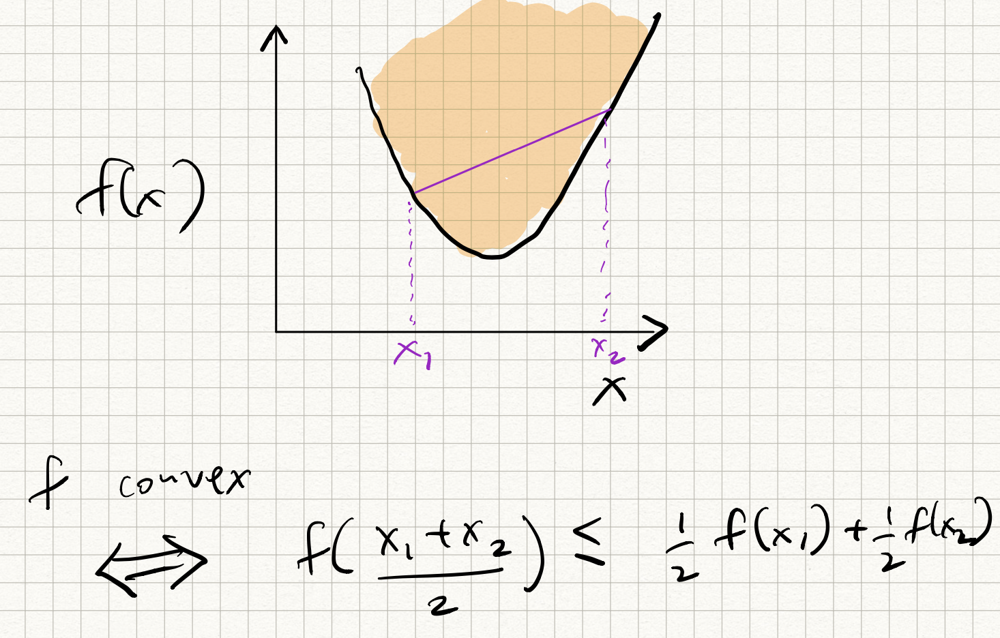
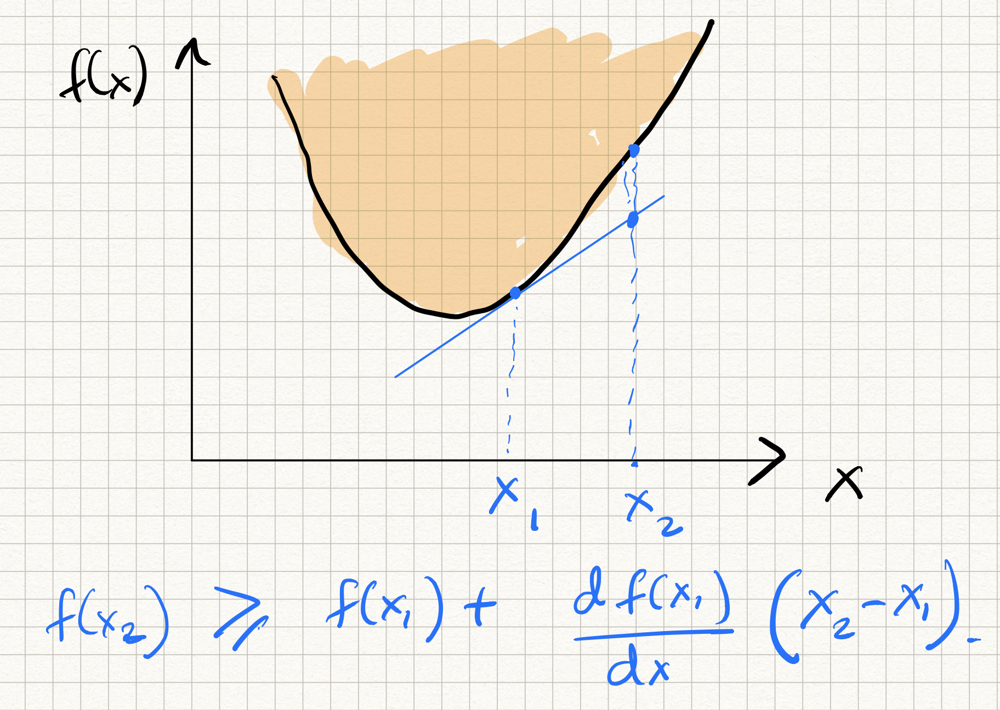

_ECE-GY 6143, Spring 2020_

## Regression Using Gradient Descent

Recall from the previous lecture that we can learn a (multivariate) linear model by minimizing the squared-error loss function:

$$
L(w) = \frac{1}{2} \|y - Xw\|^2
$$

where the norm above denotes the Euclidean norm, $y = (y_1,\ldots,y_n)^T$
is an $n \times 1$ vector containing the labels ($y$'s) and $X = (x_1^T; \ldots; x_n^T)$
is an $n \times d$ matrix containing the data ($x$'s). For simplicity we have dropped the intercept term from the regression problem.

We discovered that the optimal model is given by:

$$
w^* = \left(X^T X \right)^{-1} X^T y.
$$

If $n \geq d$ then one can generally (but not always) expect it to be full rank; if $n < d$, this is not the case and the problem is under-determined.

Computing $X^T X$ takes $O(dn^2)$ time, and inverting it takes $O(d^3)$ time. So, in the worst case (assuming $n > d$), we have a running time of $O(nd^2)$, which can be problematic for large $n$ and $d$.

### Digression: Convexity

Before we proceed, a quick overview about a *very* important topic in machine learning (and applied real analysis): *convexity*.

{ width=300px }

Let $\Omega$ denote any domain (real numbers, $d$-dimensional vector spaces, etc). Consider a function $f : \Omega \rightarrow \mathbb{R}$. Then $f$ is said to be *convex* iff for all pairs of points $x_1, x_2 \in \Omega$, and for all scalars $\alpha \in [0,1]$, we have:

$$
f(\alpha x_1 + (1 - \alpha)x_2) \leq \alpha f(x_1) + (1-\alpha)f(x_2).
$$

In words, the curve of any convex function lies "below" the straight line joining any two points on the curve. The opposite of a convex function is a *concave* function where the curve lies "above" the straight line joining any two points.

We won't have time to go very deep into functional analysis and optimization theory, but it suffices to observe that convex functions have the following beautiful property: the *first order Taylor approximation* provides a global lower bound to the function, i.e., for all $x, y \in \Omega$:

$$
f(y) \geq f(x) + \langle \nabla f(x), y - x \rangle .
$$

where, recall, that $\nabla f(x)$ is the *gradient*, or the vector of partial derivatives with respect to its coordinates, of the function $f$ at $x$. In words, the "tangent" to the curve of any convex function lies "below" the curve itself.

A direct consequence of the above property is that if the gradient vanishes at any point $x$ (i.e., $\nabla f(x) = 0$), then necessarily $f(y) \geq f(x)$ for any $x, y$, which means that $x$ is a *global minimum* of $f$.

Therefore, if we have a convex function $f$ and we find a point where its gradient vanishes ($\nabla f(x) = 0$), then we know that we have found a global minimum!

{ width=300px }

Caveat: not all functions are differentiable. If $f$ is not smooth, then the (partial) derivative is not well-defined at all points. In such cases, we can get analogous properties using something called *sub-gradients* but we will ignore that for now.

### Gradient descent

With the above mathematical tools in hand, let us discuss a different way to solve for the optimal model without inverting a system of linear equations using *gradient descent* (GD). As we will see, GD is a very useful primitive in all types of prediction problems beyond linear regression.

To actually find the minimum of any function, a canonical way to do it is to start at a given estimate, and iteratively *descend* towards new points with lower functional value. In mathematical terms, if we are at some estimate (say $\hat{w}$), suppose we found a direction $\Delta$ such that:

$$
f(\hat{w} + \Delta) < f(\hat{w}) .
$$

If we had an oracle that repeatedly gave us $\Delta$ for any $\hat{w}$ then we could simply update:

$$
\hat{w} \leftarrow \hat{w} + \Delta
$$

and iterate!

Fortunately, calculus tells us that for certain types of functions (i.e., smooth functions), the gradient at any point actually points us in the direction of *steepest descent*. This motivates the following natural (and greedy) strategy: start at some estimate $w_k$, and iteratively adjust that estimate by moving in the direction *opposite* to the gradient of the loss function at $w_k$, i.e.,

$$
w_{k+1} = w_k - \alpha_k \nabla L(w_k) .
$$

The parameter $\alpha_k$ is called the step size, and controls how far we descend along the gradient. (The step size can be either constant, or vary across different iterations). In machine learning, $\alpha_k$ is called the *learning rate*.

At any point, if we encounter $\nabla F(w) = 0$ there will be no further progress. Such a $w$ is called a *stationary point*. As we have pictorially argued above, if $F$ is smooth and convex, then all stationary points are global minima, so iteratively applying gradient descent eventually gives us the correct answer.

The nice thing is that the squared-error loss function is indeed both smooth and convex! (Easy to prove, even easier to visualize.)

Therefore, gradient descent is a reasonable approach for optimizing this type of function. we have:

$$
\begin{aligned}
w_{k+1} &= w_k + \alpha_k X^T (y - X w_k) \\
&= w_k + \alpha_k \sum_{i=1}^n (y_k - \langle w_k,x_i \rangle) x_i.
\end{aligned}
$$

Iterate this enough number of times and we are done!

Observe that the per-iteration computational cost is $O(nd)$, which can be several orders of magnitude lower than $O(nd^2)$ for large datasets. However, to precisely analyze running time, we also need to get an estimate on the total number of iterations that yields a good solution.

There is also the issue of step-size: what is the "right" value of $\alpha_k$? And how do we choose it?

### Analysis of gradient descent for linear regression

Some facts from linear algebra (stated without proof):

* An $n \times n$ matrix $A$ is said to have an *eigenvalue* $\lambda$ (in general, a complex number) if there is a vector $v \in \mathbb{R}^n$ such that $Av = \lambda v$.

* An $n \times n$ symmetric matrix $A$ has $n$ *real-valued* eigenvalues. They can be either positive or negative, and lie in some interval of the real line $(l,L)$.

* If $A$ is of the form $X^T X$, then all eigenvalues of $A$ are non-negative and $A$ is said to be *positive semi-definite* (psd).

* The eigenvalue of $A$ that has maximum absolute value (say $L$) satisfies the relation:

$$
\| A x \| \leq |L| \|x\|
$$

for all $x \in \mathbb{R}^n$.

* If $l$ and $L$ are the minimum and maximum eigenvalues of a symmetric matrix $A$, then the eigenvalues of the matrix $I - \alpha A$ lie between $1 - \alpha L$ and $1 - \alpha l$.

* As a consequence of the above two facts, for any matrix $A$ and any vector $x$, we have:

$$
\| (I - \alpha A) x \|^{}_2 \leq \max(|1 - \alpha l|, |1 - \alpha L|) \|x\|^{}_2
$$

Let us call this **Fact 1**.

We now can analyze gradient descent for the least squares loss function. From the definition of gradient, we know that for any two estimates $w_1$ and $w_2$:

$$
\nabla L(w_1) - \nabla L(w_2) = X^T X (w_1 - w_2) .
$$

Let all norms below denote the Euclidean norm. Suppose that the optimal $w$ is denoted as $w*$; by definition, the gradient vanishes here and $\nabla L(w*) = 0$. Suppose $l$ and $L$ are the minimum and maximum eigenvalues of $X^T X$. Since $X^T X$ is psd, they both are non-negative.

Then, consider the estimation error at iteration $k+1$:

$$
\begin{aligned}
\|w_{k+1} - w^* \| &= \| w_k - \alpha_k \nabla L(w_k) - w^* \| \\
&= \|w_k - w^* - \alpha_k L(w_k) \| \\
&= \|w_k - w^* - \alpha_k (L(w_k) - L(w^*))\|~~~~\text{(definition of $w^*$)} \\
&= \| w_k - w^* - \alpha_k (X^T X (w_k - w^*)) \| \\
&= \| (I - \alpha_k X^T X) (w_k - w^*) \|~~~~\text{(Fact 1)} \\
\|w_{k+1} - w^* \| &\leq \max(|1 - \alpha_k l|,|1 - \alpha_k L|) \|w_k - w^* \| .  
\end{aligned}
$$

The above inequality is nice, since it tells us that the error at iteration $k+1$ is at most $\rho$ times the error at iteration $k$, where:

$$
\rho = \max( |1-\alpha_k l|, |1 - \alpha_k L|) .
$$

If $\rho < 1$, the estimate will converge *exponentially* to the optimum. The smaller $\rho$ is, the faster the rate of convergence. We now choose $\alpha_k$ to make the above quantity to be as small as possible, and simple calculus gives us the value to be:

$$
\alpha_k = \frac{2}{L + l}
$$

and the convergence property becomes:

$$
\|w_{k+1} - w^* \| \leq \frac{L-l}{L+l} \|w_k - w^* \| .
$$

By induction over $k$, we can conclude that:

$$
\begin{aligned}
\|w_{k+1} - w^* \| &\leq \left(\frac{L-l}{L+l}\right)^k \|w_1 - w^* \| \\
&= \left(\frac{1 - \frac{l}{L}}{1 + \frac{l}{L}} \right)^k \|w_1 - w^* \| \\
&:= \rho^k \|w_1 - w^* \| .
\end{aligned}
$$

We can initialize with $w_1 = 0$ (or really, anything else) -- either way, the error decreases *exponentially* with respect to $k$. In other words, only a *logarithmic* number of iterations are required to make the estimation error smaller than some desired target.

So, takeaway points:

  1. Gradient descent converges very quickly to the right answer

  2. provided the step size is chosen correctly; more precisely,

  3. the "right" step size is $2/(L+l)$ where $L$ and $l$ are the biggest and smallest eigenvalues of the design matrix $X^T X$.

  4. In practice, one just chooses the step size by hand. In general it shouldn't matter very much as long as it isn't too large (and makes $\rho$ bigger than 1); in this case, the answer will diverge.

  5. Provided convergence occurs, the number of iterations required to push the estimation error below some desired parameter $\varepsilon$ is given by:

  $$
  T = \log_{1/\rho} \left( \frac{\|w^*\|}{\varepsilon} \right) .
  $$

  which can be much smaller than either $n$ or $d$, depending on how we set $\varepsilon$.
