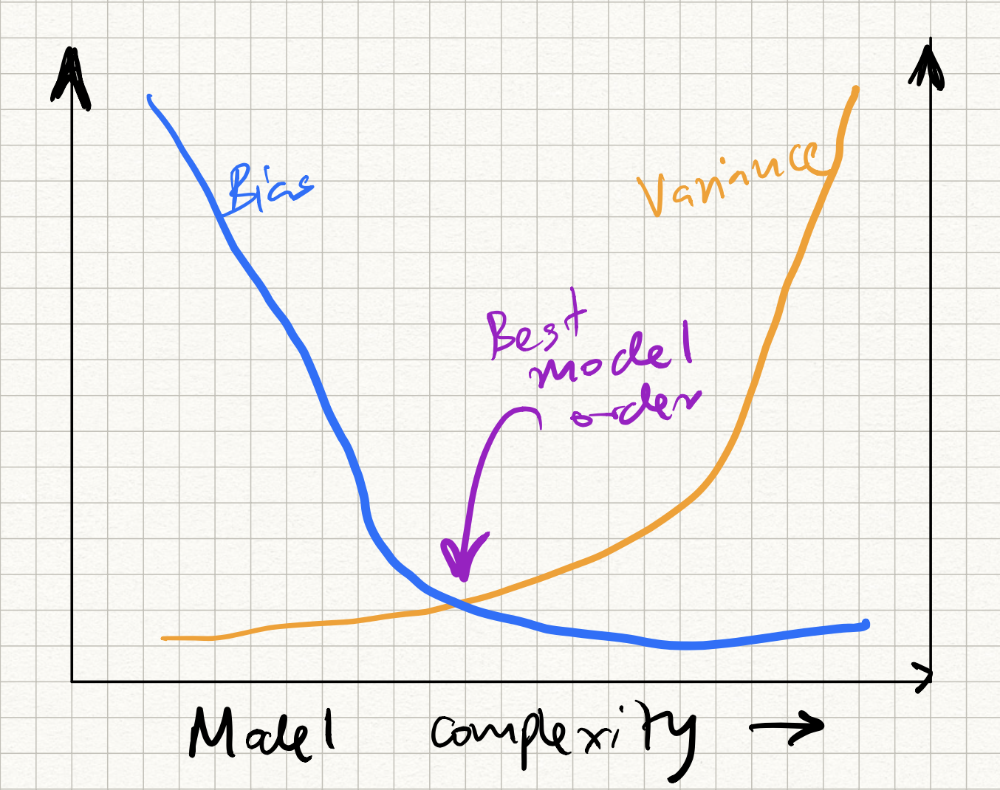

_ECE-GY 6143_

# Stochastic Gradient Descent

Recall that in the previous lecture, we derived a very simple iterative algorithm to solve linear regression: Gradient descent (GD). We showed that if the step size is chosen carefully, the parameter estimates at the $k^{th}$ iteration satisfy:

$$
\|w_{k+1} - w^* \| \leq \left(\frac{L-l}{L+l}\right)^k \|w_1 - w^* \| = \rho^k \|w_1 - w^* \|,
$$

where $l, L$ are the smallest and the largest eigenvalues of the (unnormalized) data covariance matrix $X^T X$.

Key takeaway points:

  1. Gradient descent converges very quickly to the right answer

  2. provided the step size is chosen correctly; more precisely

  3. the "right" step size is $2/(L+l)$ where $L$ and $l$ are the biggest and smallest eigenvalues of the design matrix $X^T X$.

  4. In practice, one just chooses the step size by hand. In general it shouldn't matter very much as long as it isn't too large (and makes $\rho$ bigger than 1); in this case, the answer will diverge.

  5. Provided convergence occurs, the number of iterations required to push the estimation error below some desired parameter $\varepsilon$ is given by:
  $$
  T = \log_{1/\rho} \left( \frac{\|w_0 - w_*\|}{\varepsilon} \right) .
  $$
  which can be relatively small, depending on how small we set $\varepsilon$.

## Stochastic gradient descent

One issue with gradient descent is the uncomfortable fact that one needs to compute the gradient. Recall that the gradient descent iteration for the least squares loss is given by:
$$
w_{k+1} = w_k + \alpha_k \sum_{i=1}^n (y_i - \langle w_k, x_i \rangle) x_i
$$

So, per iteration:

* One needs to compute the $d$-dimensional dot products

* by sweeping through each one of the $n$ data points in the training data set.

So the running time is $\Omega(nd)$ at the very least. This is OK for datasets that can fit into memory. However, for extremely large datasets, not all the data is in memory, and even computing the gradient once can be a challenge.

A very popular alternative to gradient descent is *stochastic gradient descent* (SGD for short). This method is picking up in popularity since dataset sizes have exponentially grown in the last few years.

The idea in SGD is simple: instead of computing the full gradient involving all the data points, we *approximate* it using a *random* subset, $S$, of data points as follows:
$$
w_{k+1} = w_k + \alpha_k' \sum_{i \in S} (y_i - \langle w_k, x_i \rangle) x_i .
$$

The core idea is that the full gradient can be viewed as a weighted average of the training data points (where the $i^{th}$ weight is given by $y_i - \langle w_k, x_i \rangle$), and therefore one can approximate this average by only considering the average of a *random* subset of the data points.

The interesting part of SGD is that one can take this idea to the extreme, and use a *single* random data point to approximate the whole gradient! This is obviously a very coarse, erroneous approximation of the gradient, but provided we sweep through the data enough number of times the errors will cancel themselves out and eventually we will arrive at the right answer.

Here is the full SGD algorithm.

**Input**: Training samples $S = \{(x_1, y_1), (x_2, y_2), \ldots, (x_n, y_n)\}$.

**Output**: A vector $w$ such that $y_i \approx \langle w,x_i \rangle$ for all $(x_i, y_i) \in S$.

  0. Initialize $w_0 = 0$.

  1. Repeat:

      a. Choose $i \in [1,n]$ uniformly at random, and select $(x_i,y_i)$.

      b. Update:
      $$
      w_{k+1} \leftarrow w_k + \alpha_k (y_i - \langle w_k, x_i \rangle) x_i
      $$
      and increment $k$.

     While epoch $\leq 1,..,maxepochs$.

We won't analyze SGD (bit messy) but will note that the step-size cannot be constant across all iterations (as in full GD). A good choice of decaying step size is the hyperbolic function:
$$
\alpha_k = C/k .
$$

One can see that the per-iteration cost of SGD is only $O(d)$ (assuming that the random selection can be done in unit-time, which is typically true in the case of random access memory). However, there is a commensurate increase in the number of iterations; suppose that after $T$ iterations, the error drops to $\varepsilon$:
$$
\|w_T - w^* \| \leq \varepsilon .
$$
Then an upper bound on $T$ is given by $O(1/\varepsilon)$.

In comparison with GD (running time of $O(nd \log(1/\varepsilon)$), SGD seems quite a bit faster $O(d/\varepsilon)$; however, if we want $\epsilon$ to be very close to zero (i.e., we seek the best possible model for the data) then the opposite is true.

Of course, keep in mind that obtaining the best possible model fit may not be the best thing to do, since the model could be over-fitted to the training data. So there are both computational as well as statistical reasons why you might want to choose SGD for regression problems.

SGD is very popular, and lots of variants have been proposed. The so-called "mini-batch" SGD trades off between the coarseness/speed of the gradient update in SGD versus the accuracy/slowness of the gradient update in full GD by taking small batches of training samples and computing the gradient on these samples. Other variants include Stochastic Average Gradients (SAG), Stochastic Mirror Descent (SMD), Stochastic Variance Reduced Gradients (SVRG) etc.

## Model selection, bias-variance tradeoffs

OK, let's hit a slight pause on the algorithms side. We have already seen 3 different algorithms to compute linear models for a given training dataset (matrix inversion, gradient descent, SGD). But why limit ourselves to linear models? Despite the benefits of linearity (easy to interpret, easy to compute, etc.) sometimes they may not always make sense:

* We assumed that the data matrix is *full-rank*, which is necessary if the matrix inverse in linear regression has to exist. This is true in general only when the number of training data points ($n$) is greater than the dimension ($d$). If we have fewer data points than dimensions, the inverse may not exist, and the problem is ill-posed with many competing solutions. In general, having more parameters than training samples is a perilous situation, since *any* dataset can be fit using a linear model. This leads to unnecessarily high *generalization error*, which we discuss below. Therefore, the linear model mau not be the right one to choose.

* More generally, we assumed that *all* the data attributes (or features) are meaningful. For example, if we are to predict likelihood of diabetes of an individual from a whole bunch of physiological measurements (height, weight, eye color, blood sugar levels, Sp02, retinal measurements, age, lipid levels, WBC counts, etc.) it is likely that only a *few* attributes actually are useful in making a prediction. The catch, of course, is that a priori we do not know which features are the most important ones. The same with predicting likelihood of an email being spam or not using word counts. While not all words contribute to the "spamminess" of a message, certain special words (which constitute a small subset of the English language) tend to give it away.

* We assumed that the data/labels intrinsically obey a linear relationship. But there is no reason that should be the case! For example, we already saw that in the vehicle mpg example, vehicle weight and mpg are inversely correlated with one another. In general, we need methods to learn more general *nonlinear* relationships in data.

The last point (nonlinear models) we will deal with when we discuss more sophisticated learning models such as kernel methods and neural nets. But one easy hack is to engineer lots of features from the data: given a data point $x$, we can compute any number of simple transformations ($x^2, x^3, \ldots, x^d, \ldots, 1/x, \ldots, \exp(-x), \ldots$), throw it all into an augmented dataset, and run linear regression on this new data. Of course, we run into the same issue as above: only a small subset of these features will be acutally relevant to our problem, but we don't a priori know which ones they are.

Let us tackle the first two aspects first (model selection). Until now, our setting has been the following. Given a training dataset $\{x_i, y_i\}$, fit a function $f$ such that $y_i \approx f(x_i)$. We assume that the data is sampled from a distribution $D$ that obeys an unknown but "true" relationship $y = t(x) + \epsilon$, where $\epsilon$ denotes irremovable i.i.d. zero-mean noise of variance $\sigma^2$.

But really, we care about performance on an *unseen* $x,y$. So even though we optimize training MSE in any regression problem, what we really care about is minimizing:

$$
\text{Test MSE} = E_{(x,y)\sim D} (y - f(x))^2 .
$$

where the expectation is over the draw of the training set and the noise.

We have no direct way to calculate this in reality (because the test set is not known beforehand). Therefore, while building ML models, this is typically simulated via a hold-out subset of the available training data, and pretending this is representative of the test-dataset. (In order to reduce simulation effects, this procedure is repeated $k$ times -- given rise to the name *k-fold cross validation*).

So let us say we have estimated the test MSE, and we would like to reduce this number. What should we do next? One path forward is revealed by decomposing the test MSE into the following expectation (with respect to the choice of training set):

$$
\begin{aligned}
\text{Test MSE} &= E_{(x,y)\sim D} (y - f(x))^2 \\
&= E (t(x) + \epsilon - f(x))^2 \\
&= E (\epsilon)^2 + E [(t(x) - f(x))^2] \\
&= \sigma^2 + E((t(x) - f(x))^2) + \text{Var}(t(x) - f(x)) \\
&= \sigma^2 + \text{Bias}^2 + \text{Variance}
\end{aligned}
$$

where $\text{Bias}$ and $\text{Variance}$ are referring to the random variable $t(x) - f(x)$. For a more comprehensive derivation, see the treatment in Bishop's textbook, Section 3.

Therefore, our MSE can be decomposed into three terms:

- Irreducible noise $\sigma^2$: nothing can be done about this.
- Bias of $f(x) - t(x)$: high bias typically corresponds to *under-fitting*, meaning that that $f$ does not express $t$ very well.  
- Variance of $f(x) - t(x)$: high variance typically corresponds to *over-fitting*, meaning that there is a lot of variation across difference draws of training sets.

This gives us a thumb rule to decide which model to select:

- attempt to decrease bias/underfitting, so want more "complex" $f$
- attempt to decrease variance/overfitting, so want "simpler" $f$

This has been classically been cast in terms of the following picture, called the *bias-variance tradeoff curve*:

{:width="75%"}

which we will experimentally demonstrate in class.

[Aside: an interesting new development is that modern ML methods such as deep neural nets do *not* seem to obey this simple tradeoff, but an analysis of why this happens is out of scope of this course.]

## Regularization: ridge regression, LASSO

How do we realize the above thumb rule in practice? One technique to define "simple" vs "complex" is to via *regularization*. Instead of minimizing the MSE, we define a *new* loss function that combines both the goodness-of-fit as well as how "complex" the function is. More specifically, we minimize:

$$
L(w) = MSE(w) + \alpha \phi(w)
$$

where $\phi(w)$ is a scalar function of $w$ called the *regularizer* and penalizes $w$ that are "unlikely", and $\alpha$ controls the level of regularization.

Common choices of $\phi(w)$ are:

* $\phi(w) = \|w\|^2_2$, the squared $L_2$ norm of $w$.
* $\phi(w) = \|w\|^{}_1$, the $L_1$ norm of $w$.

We can interpret these regularizers as follows. If we minimize:

$$
L(w) = \|y - X w\|^2_2 + \alpha \|w\|^2_2,
$$

this is called *ridge regression*, and the hope is that by constraining the Euclidean norm of $w$, we are encouraging many of the coefficients of $w$ to become small (and hence leading to lesser variance). Using vector calculus, one can show that the (closed form) minimizer can be found as:

$$
w = (X^T X + \alpha I)^{-1} X^T y .
$$

but we will skip the details here.

On the other hand, if we minimize:

$$
L(w) = \|y - X w\|^2_2 + \alpha \|w\|^{}_1
$$

this is called *LASSO* regression. The interesting feature here is that this constrains many of the coefficients of $w$ to not just become small, but explicit be *zeroed out*. Therefore, the final $w$ we get is typically sparse (i.e., most of the coefficients are zero), and the surviving coefficients that are nonzero indicate the "important" features for that given choice of training dataset and at that regularization level.

Unfortunately there is no closed form solution for actually finding the LASSO minimizer, and moreover, gradients don't exist (since the $L_1$ norm is not differentiable)! Therefore, GD/SGD cannot be applied out of the box. However, several algorithms to minimize the loss function exist, including sub-gradient descent, Least angle regression (LARS), ADMM, iterative soft thresholding, etc --- all outside the scope of this class. More to come in later lectures when we discuss SVMs.
