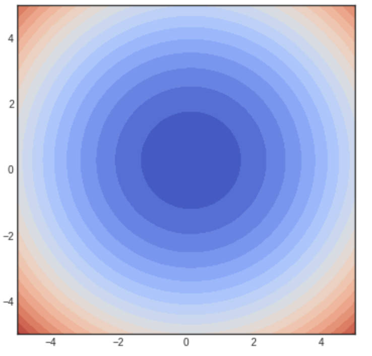
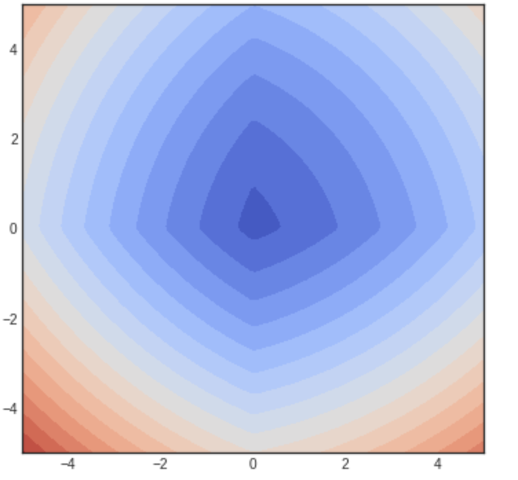

_ECE-GY 6143, Spring 2020_

# Lecture 5: Regularization, logistic regression

## Regularization: ridge regression, LASSO

We discussed how to distinguish between different models using the bias-variance curve. This gives us a thumb rule to decide which model to select:

- attempt to decrease bias/underfitting, so want more "complex" $f$
- attempt to decrease variance/overfitting, so want "simpler" $f$

One technique to define "simple" vs "complex" is to via *regularization*. Instead of minimizing the MSE, we define a *new* loss function that combines both the goodness-of-fit as well as how "complex" the function is. More specifically, we minimize:

$$
L(w) = MSE(w) + \alpha \phi(w)
$$

where $\phi(w)$ is a scalar function of $w$ called the *regularizer* and penalizes $w$ that are "unlikely", and $\alpha$ controls the level of regularization.

Common choices of $\phi(w)$ are:

* $\phi(w) = \|w\|^2_2$, the squared $L_2$ norm of $w$.
* $\phi(w) = \|w\|^{}_1$, the $L_1$ norm of $w$.

We can interpret these regularizers as follows. If we minimize:

$$
L(w) = \|y - X w\|^2_2 + \alpha \|w\|^2_2,
$$

this is called *ridge regression*, and the hope is that by constraining the Euclidean norm of $w$, we are encouraging many of the coefficients of $w$ to become small (and hence leading to lesser variance). Using vector calculus, one can show that the (closed form) minimizer can be found as:

$$
w = (X^T X + \alpha I)^{-1} X^T y .
$$

but we will skip the details here.

On the other hand, if we minimize:

$$
L(w) = \|y - X w\|^2_2 + \alpha \|w\|^{}_1
$$

this is called *LASSO* regression. The interesting feature here is that this constrains many of the coefficients of $w$ to not just become small, but explicit be *zeroed out*. Therefore, the final $w$ we get is typically sparse (i.e., most of the coefficients are zero), and the surviving coefficients that are nonzero indicate the "important" features for that given choice of training dataset and at that regularization level.

[Aside: A common question that is asked is --- what is so special about the $L_1$ norm versus the $L_2$ norm? One can derive it mathematically, but here is a quick visualization in 2D to see what is going on. Consider a simple loss function in $d=2$ dimensions, where the variable is $w = [w_1, w_2]$:

$$
L(w) = (w_1 - 1)^2 + (w_2 - 2)^2 + \alpha \|w\|^p_p
$$

where $\alpha$ is a weight parameter (here $\alpha = 6$) and $p$ is either 1 or 2 depending on which regularizer we are using. When $\alpha = 0$, the minimum is attained at the 2D point $w = (1,2)$, and the loss surface looks like a bowl/parabola emerging out of $(1,2)$.

Let us set $p=2$ (i.e., similar to ridge regression) and plot the iso-contours of $L(w)$, i.e., points of the same color represent choices of $w$ that have the same $L$ value:

{ width=45% }

so that we can see that minimum is no longer $1,2$ but gets slightly shifted closer to the origin. This is to be expected since we are penalizing the norm of $w$; but notice that the shape of the contours remains the same. However, if we set $p=1$ (i.e., similar to LASSO) and plot the iso-contours, then we get:

{ width=45% }

Note now that the shape of the contours has changed, and smaller values align magically with the x- and y- axes! This means that the $w$'s corresponding to lower values of $L$ are those which lie on the axes, i.e., whose $y$ or $x$ coordinates correspond to zero. In essence we are encouraging solutions whose coefficients are zeroed out.
]

Unfortunately there is no closed form solution for actually finding the LASSO minimizer, and moreover, gradients don't exist (since the $L_1$ norm is not differentiable)! Therefore, GD/SGD cannot be applied out of the box. However, several algorithms to minimize the loss function exist, including sub-gradient descent, Least angle regression (LARS), ADMM, iterative soft thresholding, etc --- all outside the scope of this class. More to come in later lectures when we discuss SVMs.

## Logistic regression

We will now use regression algorithms to solve *classification* problems. We will spend a lot more time on this, but classification can be viewed as a special case of regression where the predicted values are binary class labels -- $\{\pm 1\}$ (or $\{0,1\}$). Indeed, one can solve classification in this manner by simply fitting linear (or nonlinear) regression models to the data points, and rounding off the predicted value to the closest label.

However, this is not conceptually very satisfying. Suppose we develop a linear model $w$ (using regression) for a classification problem, and for a new data point $x$, we obtain a predicted value of $y = \langle w, x\rangle = -18950$. Do we round this to -1 or 1? (They are both basically the same distance away from y.)

The way to resolve this issue is as follows. Instead of finding a model $f$ such that:

$$
y_i = f(x_i),
$$

we will instead find a model $f$ such that:

$$
P(y_i =1 | x_i) = f(x_i).
$$

Here, $P(y_i=1|x_i)$ is the *conditional probability* that the label of $y_i$ is 1 given that the data point is $x$.

In a binary classification problem, the probability that the label of $y_i$ is 0 is given by:

$$
P(y_i = 0 | x_i) = 1 - f(x_i).
$$

The two equations can be combined into one by using the general expression:

$$
P(y_i | x_i) = \left(f(x_i) \right)^{y_i} \left(1 - f(x_i) \right)^{1-{y_i}} .
$$

The above expression is also called the *likelihood* of $y_i$ given $x_i$.

Given $n$ independent data points, the likelihoods will multiply. Therefore, the likelihood of a set of $n$ labels, $y \in \{\pm 1\}^n$, given a set of data points $x_1, x_2, \ldots, x_n$ is given by:

$$
P(y | X ) = \prod_{i=1}^n \left(f(x_i) \right)^{y_i} \left(1 - f(x_i) \right)^{1-{y_i}} .
$$

Instead of products, it is easier to calculate sums -- so we take logarithms on both sides. The (negative) log-likelihood is given by:

$$
L(f) = - \sum_{i=1}^n y_i \log f(x_i) + (1 - y_i) \log (1 - f(x_i)) .
$$

The goal is to find the model $f$ that minimizes the negative log likelihood (NLL) of the observed data. The term $y_i \log f(x_i) + (1-y_i) \log (1 - f(x_i)))$ is called the *cross entropy* and has its roots in information theory.

A popular choice for $f$ is the *logistic* function, where the probability function $f$ is chosen as:

$$
f(x) = \frac{1}{1 + e^{-\langle w, x \rangle}}
$$

The function $\sigma(z) = 1/(1 + e^{-z})$ is an S-shaped function called the *sigmoid*, and the logistic function is its multidimensional extension. Plugging this into the NLL function, we get:

$$
L(w) = \sum_{i=1}^n l_i(w) ,
$$

where

$$
l_i(w) = - \left( y_i \log \frac{1}{1 + e^{-\langle w,x_i \rangle}} + (1 - y_i) \log \frac{e^{-\langle w,x_i \rangle}}{1 + e^{-\langle w,x_i \rangle}} \right).
$$

## Solving logistic regression using GD

Despite its non-intuitive structure, the logistic function was carefully chosen; the sigmoid function satisfies the identity:

$$
1 - \sigma(z) = \sigma(-z) .
$$

Moreover, the derivative of $\sigma(z)$ is:

$$
\sigma(z)(1 - \sigma(z)).
$$

Using the two facts (and some calculus), one can derive the gradient update rule as:

$$
w_{k+1} = w_k + \alpha \sum_{i=1}^n (y_i - \frac{1}{1 + e^{-\langle w,x_i \rangle}}) x_i ,
$$

which, again, is remarkably similar to the update rules for linear regression as well as perceptron.

An immediate consequence of the above update rule is that the estimated model parameters $w$ is a *linear* combination of the data points -- just as how we derived them in both perceptrons and SVMs. Therefore, we can invoke the kernel trick here as well, generalize to non-linear (potentially non-separable) data, etc etc.

## Multi-class logistic regression

A rather similar formulation can be extended to more than 2 classes. Suppose that we wish to predict a label $y$ which can be any one of $0,1,\ldots,K-1$. As above, we can interpret the model $f$ as finding the conditional probability of belonging to a given class. Concretely, we have the following model for class $k$:

$$
P(y = k | x) = f(x) = \frac{1}{Z} \exp(\langle w_k, x \rangle) .
$$

To make the left hand side a valid probability distribution, the constant $Z$ should be chosen such that all the probabilities sum up to 1. Here, $Z$ is called the *partition* function and is given by:

$$
Z = \sum_{k=0}^{K-1} \exp(\langle w_k, x \rangle) .
$$

Therefore, the regression variable in multiclass logistic regression is not just a single vector $w$, but a set of vectors $w_0,w_1,\ldots,w_{K-1}$. We typically stack these up into a matrix $W$.

(We also observe that since $\exp(a-b) = \exp(a) \exp(-b)$, we get an *equivalent* solution by simply setting $w_0 = 0$. In the case of $K=2$ this exactly corresponds to logistic regression.)

The lost function is also similar -- we simply generalize the notion of cross-entropy to more than 2 classes. In that case, we get:

$$
\begin{aligned}
L(W) &= \sum_{i=1}^n l_i(W)
&= \sum_{i=1}^n \sum_{k=0}^{K-1} \mathbf{1}\{y^i = k\} \log \frac{\exp(\langle w_k, x_i \rangle)}{Z} ,
\end{aligned}
$$

where $\mathbf{1}\{y_i = k\}$ is the *indicator* function which is equal to 1 when the index $k$ corresponds to the class of $y_i$ and zero otherwise. The above loss function $L(W)$ is called the *softmax* loss function, and is commonly used for multi-class classification problems --- not just in logistic regression, but in more complicated supervised learning systems (such as deep networks).
