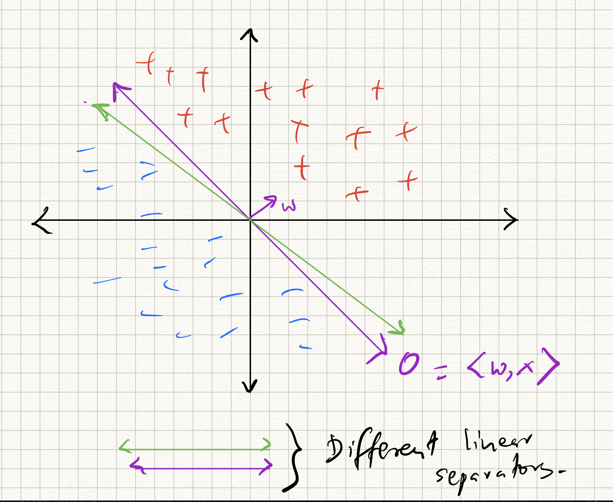
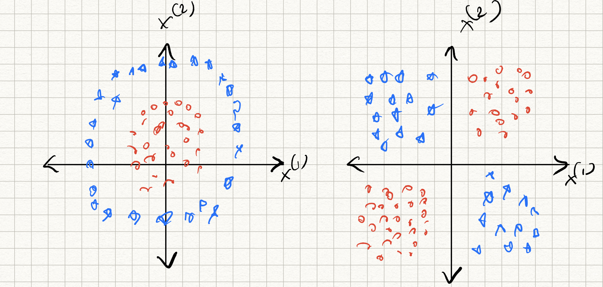

# SVMs and Kernel Machines

The issue with the logistic and the perceptron classifiers that we have discussed so far is that they are *brittle*, and do not always provide robust separators. For example, if the data is separable, the perceptron returns *a* separator (one among the infinitely many linear separators that exist.) How can we get the *best* separator?

{ width=50% }

To answer this question, we revisit the perceptron. Recall from previous lecture notes that we presented the perceptron as an *algorithm*. However, we skipped the middle step in any machine learning formulation -- defining the *loss function*. What loss function does the perceptron optimize?

Suppose the (training) data $D = \{(x_i,y_i)\}_{i=1}^n$ is separable via a separating hyperplane (specified by $w$) that passes through the origin. The only condition is that $y_i = \text{sign}(\langle w, x_i \rangle)$. Therefore, the perceptron can be interpreted as solving a *feasible solution* to the problem:

$$
\begin{aligned}
\text{Find} \quad & w \\
\text{s.t.} \quad & \text{sign}(y_i) = \text{sign} (\langle w, x_i \rangle),  \quad i = 1,\ldots,n.
\end{aligned}
$$

(Above and henceforth, "s.t." is short for "subject to constraints").

Let us rewrite this problem a little bit: this will help us address the nonseparable case as well. For the $i$th training sample, define the *hinge loss* as follows:

$$
\begin{aligned}
l_i(w) = \begin{cases}
0, \qquad \qquad \text{if}~y_i \langle w, x_i \rangle \geq 1, \\
1 - y_i \langle w, x_i \rangle,~\text{otherwise}.
\end{cases}
\end{aligned}
$$

The intuition behind this definition of the hinge loss is that there is no penalty if the prediction made by $w$ matches the sign of the label *and* is sufficiently far away from the decision boundary. Otherwise, if the sign of $y_i$ is different from the sign of $\langle w, x_i \rangle$, we incur an increasingly a growing penalty. A short form of the above loss can be written as:

$$
l(w) = \max(0, 1 - y f(x))
$$

where $f(x) = \langle w,x \rangle$ is the linear classifier that we have set up. Therefore, the overall hinge loss for the entire training dataset can be written as:

$$
L_{\text{hinge}}(w) = \sum_{i=1}^n \max(0, 1 - y_i \langle w_i, x \rangle)
$$

Observe that the hinge function is not differentiable; however, it is piecewise linear, and for each piece we can compute gradients. Therefore, a (sub) gradient of this function for the $i$th sample can be written as:

$$
\nabla L_{\text{hinge}}(w) = \begin{cases}
0, \qquad \text{if}~y_i \langle w, x_i \rangle \geq 1, \\
- y_i x_i ,~\text{otherwise}.
\end{cases}
$$  

and we can run gradient descent (or SGD, or minibatch SGD) as usual on the above loss.

If we ran SGD with minibatch size 1, the above gradient update looks suspiciously like what we did with the perceptron! However, observe the (subtle) difference: for the $i$th training sample:

* Perceptron does nothing if the sign of $y_i$ matches the sign of $\langle w, x_i \rangle$, i.e., if $y_i \langle w, x_i \rangle \geq 0$; else it updates the model weights with $y_i x_i$,
* while the above updates does nothing if the $y_i \langle w, x_i \rangle \geq 1$; else it updates the model weights with $y_i x_i$.

OK, almost there. If we now add a ridge-regression type regularizer to this loss function, we get the augmented loss:

$$
L_{\text{SVM}}(w) = \sum_{i=1}^n \max(0, 1 - y_i \langle w_i, x \rangle) + \frac{\lambda}{2} \|w\|^2_2 .
$$

The minimizer of the above  is called the *support vector machine* (SVM), and the above problem is called the *primal SVM* problem. The reason for the name will be explained below when we discuss duality theory. Until modern neural nets came about (in the early part of the last decade), SVMs were pretty much considered the state of the art. Even today, they are used as useful baseline models in a lot of machine learning applications.

## SVMs and dual interpretation

The origin of the name "support vectors" is a bit involved and requires knowledge of a fair bit of optimization theory. If you are not interested in gory optimization details, **you can skip ahead** to the end of this section; if you are interested, then read on.

Let us step back a bit and consider a more general optimization problem with $d$-dimensional variables and $n$ inequality constraints.

$$
\begin{aligned}
& \min_x f(x) \\
\text{s.t.} \quad & g_i(x) \geq 0.
\end{aligned}
$$

We will call this the *primal problem*, or $P$ for short, and denote its optimum as $x_P$.

Define a vector $\alpha \in \mathbb{R}^n$. The *Lagrangean* of this problem is defined as the new function:

$$
\mathcal{L}(x,\alpha) = f(x) + \sum_{i=1}^n \alpha_i g_i (x) .
$$

The $\alpha_i$'s are called the Lagrangean multipliers.

The quantity

$$
F(x) = \max_{\alpha_i \leq 0} \mathcal{L}(x,\alpha)
$$

is a function of $x$. Observe if that if $x$ violates any one of the $i$ primal constraints in $P$, then $g_i(x)$ is negative, and by choosing the corresponding $\alpha_i$ as an arbitrary large negative number, $F(x)$ can be made arbitrarily large.
On the other hand, if $x$ satisfies all the primal constraints, the value of $g_i(x)$ is non-negative; hence, the maximum value of $\mathcal{L}(x,\alpha)$ is obtained by setting all the $\alpha_i$ to zero and $F(x) = f(x)$.

Therefore, the optimal value of $P$ can be re-written as:

$$
\min_x \max_{\alpha_i \leq 0} \mathcal{L}(x, \alpha)
$$

Now, consider a slightly different operation on $\mathcal{L}$, except that the "min" and "max" have been interchanged; first, we minimize $\mathcal{L}(x,\alpha)$ over $x$:

$$
G(\alpha) = \min_x \mathcal{L}(x,\alpha)
$$

and then maximize with respect to $\alpha$, with the constraints that $\alpha_i \leq 0$:

$$
\begin{aligned}
& \max_\alpha G(\alpha) \\
\text{s.t.} \quad & \alpha_i \leq 0 .
\end{aligned}
$$

Call the above problem the *dual problem*, or $D$ for short, and denote its optimum as $\alpha_D$. Therefore, we basically solve the optimization problem:

$$
\max_{\alpha_i \leq 0} \min_x \mathcal{L}(x,\alpha).
$$

By flipping the order of the "min" and "max", a natural question is whether the optimal answers will be same or different. However, two important results can be proved:

- **Property 1**: a property called *Slater's condition* asserts that for usual *convex* functions $f$ and $g$, something known as *strong duality* holds, i.e., the $x$ (and corresponding $\alpha$) obtained by the two procedures are indeed the same.

- **Property 2**: another property called *complementary slackness* says that the optimal multipliers $\alpha_i$ will be non-zero **only if** the corresponding constraints $g_i(x)$ hold with equality at the optimum, i.e., $g_i(x_P) = 0$.

Again, we won't go into details of why the above results are true; take a convex optimization class if you are interested to learn more.

How does all this connect to SVMs?

Observe that the primal SVM problem can be rewritten as an instance of a constrained optimization problem:

$$
\begin{aligned}
\min_{w,z} & \frac{1}{2} \|w\|^2_2 + C \sum_{i=1}^n z_i \\
& z_i \geq 0, \\
& z_i \geq 1 - y_i \langle w_i, x \rangle
\end{aligned}
$$

Intuition: the relation $c = \max(a,b)$ can be written as the pair of inequalities $c \geq a, c\geq b$, and the equality is achieved when $a = b$.

(Note also that we have replaced $\lambda$ with the variable $C$ by weighting the original loss term instead.)

We can write out the Lagrangean:

$$
\mathcal{L}(w,z,\alpha,\beta) = \frac{1}{2} \|w\|^2_2 + C \sum_{i=1}^n z_i + \sum_{i=1}^n \alpha_i (y_i \langle w, x_i \rangle - 1 - z_i) + \sum_{i=1}^n (-\beta_i) z_i.
$$

where $\alpha_i$, $\beta_i$ are *non-negative*. Now, let us construct the dual. Following the steps above, the inner "min" optimization can be solved by taking the derivative of $\mathcal{L}$ with respect to $w$ and setting to zero. We get:

$$
\begin{aligned}
\nabla_w \mathcal{L}(w^*,z,\alpha,\beta) &= 0, \quad \text{i.e.,} \\
w^* + \sum_{i=1}^n \alpha_i y_i x_i &= 0, \quad \text{or} \\
w^* &= - \sum_{i=1}^n \alpha_i y_i x_i .
\end{aligned}
$$

Similarly, we can take the derivative with respect to $z$ and set to zero to get:

$$
\beta_i + \alpha_i = C.
$$

Since $\alpha_i$ and $\beta_i$ are both non-negative, we get that $0 \leq \alpha_i \leq C$.

Finally, we can plug in the above values into $\mathcal{L}$, simplify a bit, and optimize over $\alpha$:

$$
\begin{aligned}
\max_\alpha \quad & - \sum_{i=1}^n \alpha_i - \sum_{i,j = 1}^{n} y_i y_j \alpha_i \alpha_j \langle x_i, x_j \rangle \\
\text{s.t.} \quad & 0 \leq \alpha_i \leq C, \quad i = 1,2,\ldots,n.
\end{aligned}
$$

This problem is called the *dual SVM* problem. Again, similar to the primal SVM, the objective function is a quadratic function of the dual variables $\alpha$, while the constraints are linear inequalities involving of $\alpha$.

The above insights let us make the following observations:

> The optimal separating hyperplane $w^*$ is a **linear** combination of the data points $x_i$, weighted by the labels $y_i$ and the corresponding dual variables $\alpha_i$.

and:

> Due to Property 2, the values of $\alpha_i$ and $\beta_i$ are *both* non-zero if the corresponding data points $x_i$ **exactly** satisfy the primal constraints, i.e., they are the ones closest to the decision boundary.

Therefore, the data points which induce non-zero dual multipliers are the ones which influence the final separating hyperplane, and hence called *support vectors*. This is in fact the origin of the term "support vector machine".

Therefore, to perform a classification on a new, unseen data point $x$, we only need to store the set of support vectors, $S$, i.e., the non-zero $\alpha_i$ and the corresponding $x_i$. The predicted label of $x$ is:

$$
y = \text{sign} \left(\sum_{i \in S} \alpha_i \langle x, x_i \rangle \right) .
$$

## Kernel methods and data separability

The perceptron algorithm is simple and works well. However, it (provably) works only when the data is *linearly* separable. If not, its performance can be poor.

Datasets in applications can be far more complicated. Consider the case of two dimensional data ($d=2$). We will consider a toy hypothetical example where the data corresponds to measurements that you collect from a pair of sensors observing a system at various instants. The goal is to classify the system state as properly functioning or not.

Two examples of non-separable acquired measurements for this application are as follows:

- XOR-distributed data: Let's say that the system is properly functioning if both sensor readings are consistent, i.e., they are both positive-valued, or both-negative valued. Therefore,  the "+"-labeled examples all lie in the first and third quadrants, while the "-"-labeled examples all lie in the second and fourth quadrants. Here, the ideal classifier is given by:

$$
y = \text{sign}(x_1 x_2)
$$

- Radially-distributed data: Let's now say that the system is properly functioning if the Euclidean norm of the sensor readings is smaller than some amount. Therefore, the "+" examples all lie within a circle of radius $R$ from the origin, and "-" examples lie outside this circle. Here, the ideal classifier is given by

$$
y = \text{sign}(x_1^2 + x_2^2 - R^2)
$$

{ width=90% }

In both cases, no linear separator of the form $y = \text{sign}(w_1 x_1 + w_2 x_2 + b)$ can separate the two classes. The perceptron algorithm would fail on such datasets.

The key idea in kernel methods is to map the given data to a *different* (typically, higher-dimensional) feature space:

$$
x \rightarrow \phi(x)
$$

using some nonlinear function $\phi(\cdot)$.

For example, in the above two dimensional examples, suppose we transformed each data point into *six*-dimensional space using the feature mapping:

$$
x = (x_1,x_2) \rightarrow \phi(x) = (1,x_1,x_2,x_1x_2,x_1^2,x_2^2).
$$

Then we find that in the new feature space, both the XOR and the circle examples are perfectly separable. (*Exercise: find a separating hyperplane for these two examples by explicitly writing out a suitable $w$ for each case.*) If we ran the perceptron on these new examples, it would perfectly work.

## The kernel trick

Two immediate questions are:

> How to choose the feature mapping function $\phi$?

This is tricky to answer, and is heavily dataset dependent. The short answer is to use *all* possible features that you can think of. (The risk here is that you might overfit.)

For example, given the data vector $(x_1,x_2,\ldots,x_d)$, common features include:

- the original features as is;

- a quadratic function of the features $x_1^2, x_2^2, \ldots, x_d^2, x_1 x_2, x_2 x_3, \ldots, x_i x_j, \ldots$. These are particularly useful for classifying datasets which have circles, ellipses, parabolas, or other conic surfaces as separating surfaces.

- any polynomial combination of the features $x_1^{\alpha_1} x_2^{\alpha_2} \ldots  x_d^{\alpha_d}$, where $\alpha_i \geq 0$ is an integer and $\sum_{i}^r \alpha^i \leq r$.

- nonlinear features of the co-ordinates, such as $\sin(x_i)$, $\cos(x_i)$, or any combinations of the above.

- other domain specific features. For example, in image classification applications, the input features correspond to pixel intensity values, and there are standard features (such as corners, edges, etc) that can be computed from the input pixel intensities.

The process of mapping input feature vectors $x$ into a higher-dimensional space $\phi(x)$ is known as *lifting*. Lifting only increases separability if carefully designed. However, this leads to the second question:

> Is this procedure computationally efficient?

Even in simple cases, the computational complexity of lifting into a higher-dimensional space can quickly become untenable. In the above sensor examples, we created 6 features from $d=2$ features. For general $d$-dimensional data, this number rises to $1 + 2d + \binom{d}{2}$ (the constant offset 1, the original features, squares of the original features, and all pairwise combinations.) This is already $O(d^2)$, and infeasible for $d$ very large.

In general, if we wanted all degree $r$ polynomial features, the dimension of the lifted feature space is $O(d^r)$. How do we deal with such large feature spaces?

A particularly simple solution can be achieved via something called the *kernel trick*. The key is to realize that in the higher-dimensional space, the only computations that we perform on the data is a bunch of dot-products. (For example, in the perceptron algorithm we only need to check a bunch of times the sign of $\langle w,x \rangle$) for different $x$. Therefore, in most cases *we do not need explicitly write out all the features* (however high-dimensional they are); all we need is a mechanism to query pairwise dot products.

Formally: given a feature mapping $x \rightarrow \phi(x)$, the kernel inner product of a pair of vectors is given by:

$$
K(x,z) = \langle \phi(x), \phi(z) \rangle
$$

For *certain* feature mappings, the kernel inner product is efficiently computable. Consider the quadratic kernel:

$$
(x_1, x_2, \ldots, x_d) \rightarrow (1, \sqrt{2} x_1, \ldots, \sqrt{2}x_d, x_1^2, \ldots, x_d^2, \ldots, \sqrt{2} x_i x_j, \ldots)
$$

(The $\sqrt{2}$ factors are for convenience only and do not affect computation using perceptrons, etc. The net result is that the corresponding co-ordinates of the learned $w$ vectors will be scaled by $1/\sqrt{2}$.)

The kernel inner product is:

$$
K(x,z) = 1 + 2x_1 z_1 + \ldots 2x_d z_d + x_1^2 z_1^2 + \ldots x_d^2 z_d^2 + \ldots 2 x_i x_j z_i z_j + \ldots
$$

But one can check that this is equal to:

$$
\begin{aligned}
K(x,z) &= (1 + \sum_{i=1}^d x_i z_i)^2 \\
&= (1 + \langle x,w \rangle)^2 .
\end{aligned}
$$

Therefore, even though the feature space is $O(d^2)$ dimensional, the kernel inner product can be computed using $O(d)$ operations.

Similarly, for polynomial features of degree $r$, one can compute the kernel inner product using the formula:

$$
K(x,z) = (c + \langle x,z \rangle)^r .
$$

Essentially, the kernel inner product $K(x,z)$ measures how similar $x$ and $z$ are in the lifted feature space, just as how the standard inner product (dot product) $\langle w,z \rangle$ measures how similar $x$ and $z$ are in the original space.  Therefore, *algorithmically*, one can simply replace all occurrences of $\langle \dot, \cdot \rangle$ by $K(\cdot, \cdot)$, and we are done!

We do not have to go through the intermediate, expensive step of writing down the transformation $\phi(\cdot)$. In other words, instead of choosing good feature spaces (specified by $\phi$), we instead implicitly seek feature spaces by looking for good kernel inner products (specified by $K(\cdot,\cdot)$).

One example of a popular kernel inner product is given by the Gaussian radial basis function:

$$
K(x,z) = \exp(-\frac{\|x-z\|^2_2}{\sigma^2})
$$

where $\sigma$ is the *bandwidth* parameter. This is an example of a kernel for which the implicit feature mapping $\phi$ is *infinite-dimensional*, yet the kernel inner product is straightforward to compute and requires $O(d)$ time.
