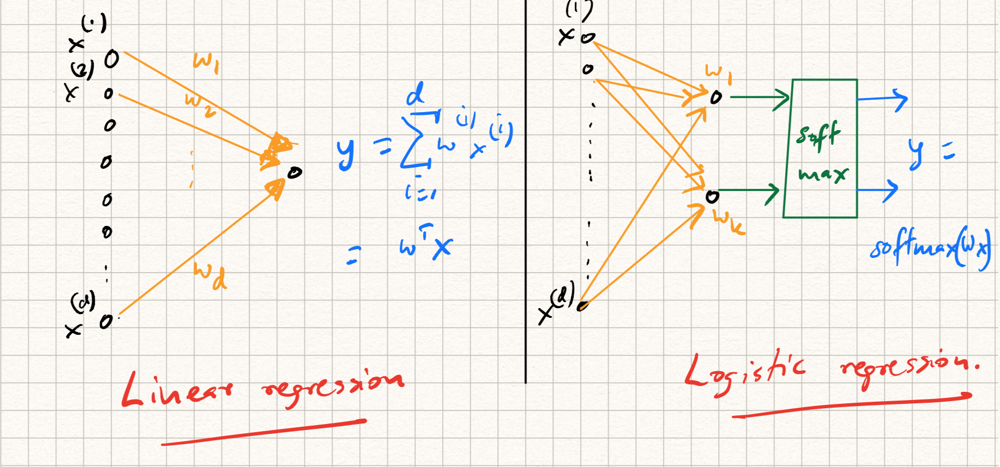
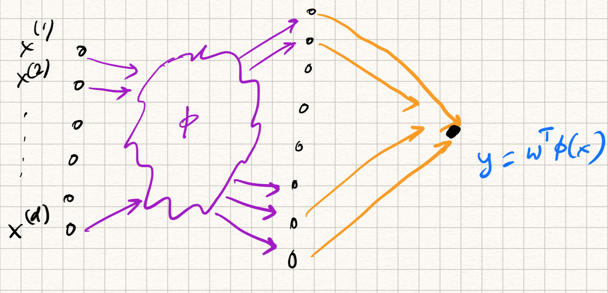

_ECE-GY 6143, Spring 2020_

# Kernels and MLPs

To recap the ideas underlying kernel methods:

* if your data is not amenable to linear models, then one can make it so by "lifting" into a (potentially) high dimensional space via several new nonlinear features;

* however, this can cause (severe) computational challenges, since the dimensionality of the lifted space can be quite high;

* to resolve this, we use kernel inner products $K(x,z)$ instead of standard inner products $\langle x,z \rangle$ in order to perform efficient computations.

This idea is surprisingly powerful, and can be useful in most machine learning algorithms that primarily rely on inner products. The overall approach is sometimes call the *kernel trick*.

## Choosing kernel inner products

Choosing a "good" kernel for a given task can be a challenge. Not all functions $K(\cdot,\cdot)$ can be chosen when defining kernels. The main criteria that we need to maintain are:

- Efficient computation: $K(x,z)$ must be efficiently computable for any $x,z$.

- Symmetry: $K(x,z) = K(z,x)$ for all $x,z \in \mathbb{R}^d$.

- Dot product property: there exists a feature mapping $\phi$ such that $K$ is equal to the dot product in the lifted feature space, i.e., $K(x,z) = \langle \phi(x), \phi(z) \rangle$.

The first two are fairly easy to verify for a given $K$; the last one is not. A result in applied linear algebra, known as *Mercer's Theorem*, states that a function $K(\cdot,\cdot)$ is a legitimate kernel if for *any* set of $n$ data points $x_1, x_2, \ldots, x_n$, the symmetric $n \times n$ matrix $M$ formed using the formula:

$$
M_{i,j} = K(x_i,x_j)
$$

is *positive-semidefinite*; i.e., it has no negative eigenvalues. However, this is not easy to check either since this has to hold for *all subsets* of $n$ points in the data space.

Basically, bottom line: choosing kernels is not trivial and needs to be done carefully. Instead, let's just agree that any recursive composition of the following rules lead to well-defined kernels:

* $K(x,z) = \langle x, z \rangle$. This is the regular dot product, and leads to the *linear kernel*.

* $K(x,z) = \text{poly}(k(x,z))$ where $k$ is any kernel and $\text{poly}$ is any polynomial function with positive coefficients. This leads to the *polynomial kernel*.

* $K(x,z) = a k_1(x,z) + b k_2(x,z)$, where $a$ and $b$ are constants. This means that linear combinations of kernels can be used to give rise to other kernels.

* $K(x,z) = \exp^{k(x,z)}$, i.e., taking exponents give rise to new kernels.

* $K(x,z) = f(x) k(x,z) f(z)$, i.e., pre- and post-multiplying by any function gives rise to a new kernel.

The last two rules are interesting, since we can use it to prove that the following function is a legitimate kernel inner product:

$$
K(x,z) = \exp^{-\gamma{\|x - z\|^2_2}}
$$

(Exercise: prove mathematically that this can be written as an inner product!)

This is a very commonly used kernel and has various names: the *Gaussian kernel* or the *RBF kernel*, where RBF stands for "radial basis function". We will discuss the origin of this name below. The parameter $\gamma$ is called the *bandwidth parameter* of the RBF kernel and controls how sharply the Gaussian function is peaked.

## The kernel perceptron

Let us instantiate the kernel trick for learning *nonlinear* separators using the perceptron algorithm.

Let us say that an oracle has given us the "right" mapping that implicitly lifts the data into a higher-dimensional feature space, $x \rightarrow \phi(x)$. We need to learn a separator $w$ in this new feature space, but without actually *writing* it out for each data point.

**Input**: Training samples $S = \{(x_1, y_1), (x_2, y_2), \ldots, (x_n, y_n)\}$.

**Output**: A vector $w$ such that $y_i = \text{sign}(\langle w,\phi(x_i) \rangle)$ for all $(x_i, y_i) \in S$.

  0. Initialize $w_0 = 0$.

  1. Repeat:

      a. For each $(x, y) \in S$, if $\text{sign}(\langle w_t, \phi(x)) \rangle) \neq y$, update
      $$ w_t \leftarrow w_{t-1} + y \phi(x) .$$

      b. If no change in $w_t$ after sweeping through the data, terminate.

     While epoch $\leq 1,..,maxepochs$.

There is a catch here, though. The above algorithm involves computations with $\phi(x_i)$; however, as discussed above, this can be expensive if the mapping is high dimensional.

We resolve this using two observations:

- At each time instant, the estimate $w_t$ is a *linear combination* of vectors $\phi(x_i)$, where $x_i$ is some list of training vectors. This is a consequence of line 1b in the algorithm, since that is the way we constructed $w_t$. Call this list $L$. Therefore,

$$
w_t = \sum_{i \in L} \alpha_i \phi(x_i) .
$$

The $\alpha_i$ can be positive, or negative, or zero, depending on how many times the data point $x_i$ in the list has appeared in one of the nonzero updates to $w$, and what its label $y_i$ is.

- Therefore, while checking for consistency of the sign in Line 1a, the dot product with $\phi(x)$ can be evaluated as follows:

$$
\begin{aligned}
\langle w_t, \phi(x) \rangle &= \langle \sum_{i \in L} \alpha_i \phi(x_i), \phi(x) \rangle \\
&= \sum_{i \in L} \alpha_i \langle \phi(x_i), \phi(x) \rangle \\
&= \sum_{i \in L} \alpha_i K(x_i, x) .
\end{aligned}
$$

Observe that the dot product in Line 1a can be replaced by the kernel inner product! The above two observations tell us that *there is no need to ever compute $\phi(x)$ explicitly*; instead, we just store the list of data points whose linear combination synthesizes $w_t$ at each time instant, update this list as necessary, and test for consistency by using the kernel trick.

The training time of the kernel perceptron, therefore, is similar to that of the original perceptron -- $O(nd)$ -- assuming that computing the kernel inner product $K(\cdot,\cdot)$ is as easy as computing standard inner products.

This is how you train the kernel perceptron. Testing is analogous: the final weight vector $w$ will be associated with a list of data coefficients $\alpha_i$, one for each data point. For a new test point, we just use the same equation as above to compute $\langle w, \phi(x) \rangle = \sum_{i \in L} \alpha_i K(x, x_i)$.

## Applying the kernel trick to other learning algorithms

The technique described above can be replicated to many other learning algorithms that involve a linear combination of the inputs, such as linear regression, SVMs, and so on. The idea follows in three steps:

* Establish that the optimal model can be written as a linear combination of the data points:

$$
w = \sum_{i=1}^n \alpha_i x_i .
$$

* Ensure that all steps in the learning method can be reproduced by accessing only inner products of the form $\langle x_i, x_j \rangle$ between training and test points.

* Identify a good kernel inner product $K(\cdot, \cdot)$ and replace all occurrences of $\langle x_i, x_j \rangle$ with $K(x_i, x_j)$.

Interestingly, the kernel trick can be used to make an interesting connection between $k$-nearest neighbors and perceptrons/SVMs (although we presented them as separate algorithms). For simplicity, assume $k=1$. For a training dataset $\{(x_1, y_1), \ldots, (x_n, y_n)\}$ we can rewrite the decision made by a $1$-NN classifier as:

$$
f(x) = \text{sign} (\sum_{i=1}^n y_i \delta(x,x_i))
$$

where $\delta$ denotes the delta function and is 1 if $x_i$ is the nearest neighbor of $x$ and 0 everywhere else.

On the other hand, the kernelized version of perceptrons/SVMs have the (final) expression for the prediction:

$$
f(x) = \text{sign} (\sum_{i=1}^n \alpha_i y_i K(x,x_i)) .
$$

where $K$ is a kernel inner product. In particular, if we use the RBF kernel with $\sigma$ chosen very small, the function $K$ gives more weight to $x_i$ that are close to $x$ and less weight to $x_i$ that are further away.

In some sense, the kernel trick can be viewed as a nicely implemented version of *soft* or *weighted* nearest neighbors where the weights are automatically learned. Recall that in SVMs, most of the $\alpha_i$'s are zero, and the ones that remain are the support vectors. Therefore, RBF-kernel SVMs basically work by choosing only the data vectors that are closest to the input while discarding all the remaining ones.

## Multilayer perceptrons

Ignore kernels for a moment. We know that a single perceptron provides a single (linear separator, i.e., divides any given feature space into two half-spaces. For any given input data point, testing with $w$ indicates which class the point belongs to. The decision boundary between the classes is a hyperplane.

Suppose that we now consider the output of *two* perceptrons acting on the same data. Therefore, for a given input $x$, we have outputs:

$$
\begin{aligned}
y^{(1)} &= \text{sign}(\langle w^{(1)},x \rangle), \\
y^{(2)} &= \text{sign}(\langle w^{(2)},x \rangle).
\end{aligned}
$$

Now imagine a third perceptron $w^{3}$ *that combines (pools) these outputs*, i.e.,

$$
y = \text{sign}(w^{(3)}_1 y^{(1)} + w^{(3)}_2 y^{(2)}).
$$

Clearly, $y$ is a nonlinear function of the input $x$. If we start drawing decision boundaries checking which $x$ gave rise to positive $y$, and which ones gave rise to negative $y$, then the boundaries are extremely nonlinear depending on $w^{(1)}, w^{(2)}, w^{(3)}$.

Three extensions to this basic idea:

- Why stop at two perceptrons $w^{(1)}, w^{(2)}$? We can imagine any number of such "first-level" perceptrons.

- Why stop at a single pooling perceptron? We can imagine multiple such pooling combinations, corresponding to different outputs. We can call this set of perceptrons the "output layer", and the set of first-level perceptrons the "hidden layer".

- Lastly, why stop at a single hidden layer? We can repeat this idea several times, creating several hidden layers of perceptrons; each layer combining the outputs of the previous layer, as well as serving as inputs to the next. One can show that using a sufficient number of such hidden layers, one can reproduce *any* nonlinear separating surface.

A nice visualization of this idea can be found here.

http://playground.tensorflow.org

Try varying the number of perceptrons, hidden layers, etc for the various datasets (using the original feature space). Now try the same using kernels, and see what happens. Are there any benefits in using combinations of both?

## From linear models to neural networks

Let us try to make this connection between linear models, kernels, and neural networks a bit more formal. The key concept linking these different models is to imagine the computations as being composed of *layers* in a directed graph.   

For example, while training/testing a linear regression model, the following steps are involved:

* The input $x$ is dotted with a weight vector $w$, i.e., $\langle w, x \rangle$.

* The predicted output $\langle w, x \rangle$ is compared with the label $y$ using the squared error loss $l(y,w^T x) = 0.5 \|y - w^T x\|^2_2$.

* While training via SGD, the gradient of this loss function is used to update the weights.

On the other hand, while training a ($k$-class) logistic regression model (referring back to earlier lecture notes), we have an extra step:

* The input $x$ is dotted with $k$ weight vectors $w_j$.

* The (intermediate) output $z = (\langle w_1, x \rangle, \ldots, \langle w_k, x \rangle$ is passed through a *softmax* layer to get the prediction:

  $$
  \hat{y} = \text{softmax}(z),~~\text{where}~~\hat{y}_j = \frac{\exp{\langle w_j, x \rangle}}{\sum_{j=1}^k \exp{\langle w_j, x \rangle}}.
  $$

* The predicted output is compared with the label using cross-entropy loss: $l(y,\hat{y}) = - \sum_{i=1}^k y \log(\hat{y})$. Here, $y$ is a label indicator, or *one-hot* vector indicating the correct class.

* While training via SGD, the gradient of this loss function is used to update the weights.

Each of the above procedures can be illustrated as a computational graph as illustrated in Figure 1.

{:width="90%"}

The same steps are used for kernel SVMs (and something very similar for kernel perceptrons):

* The input $x$ is first passed through the *kernel* feature mapping $\phi$, and then dotted with the weight vector $w$, i.e., $\langle w, \phi(x) \rangle$. Of course, the kernel trick avoids explicit calculation of such a mapping but conceptually this is what happens.

* The predicted output $\langle w, x \rangle$ is compared with the label $y$ using the hinge loss $l(y,w^T \phi(x)) = \max(0, 1 - y w^T \phi(x))$.

* While training via SGD, the gradient of this loss function plus an extra $\ell_2$-regularizer is used to update the weights.

So the computational graph looks something like Figure 2.

{:width="90%"}

Now notice the following: we have always used a *user-specified* kernel mapping function $\phi$ (or equivalently, a *user-specifed* kernel dot product $K(\cdot, \cdot)$, such as an RBF.

What if the kernel mapping $\phi$ itself is learnable from data instead? For example, instead of the user specifying the mapping, we can stick in a linear, or logistic model, or any composition of such models in there, or a multi-layer network in there. So in that sense, the "last" layer of the network is the classification layer, and the "first" several layers implements the kernel mapping. This way of thinking unifies the various models we have seen thus far.
